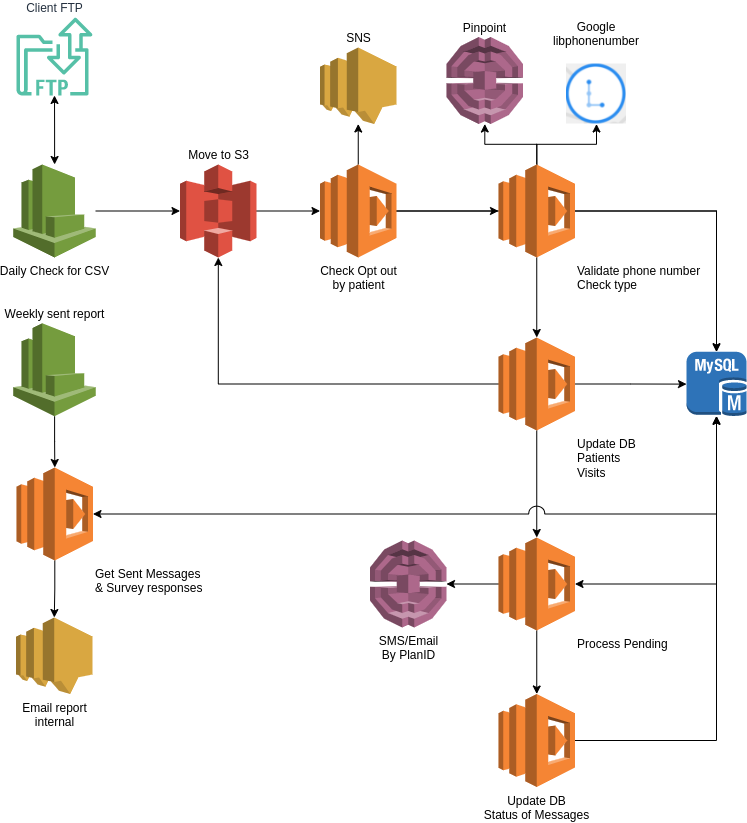

# Courier System Overview #
Courier is a system that takes an input file (e.g. CSV) with recipient
information (and other information), sends messages to those recipients using
AWS, and tracks those messages in a MySQL DB.
## Architecture ##
Below is the 'to be' architecture.  
The python library Courier enables the functionality, and is executed by the
multiple lambda functions.  
  
## Repository Folder Structure ##
The following may be useful in understanding where things are in this
repository:  
- **automation** - files related to automating Courier's AWS pipeline
buildout (e.g. Cloudformation)
- **Base-Docker** - files related to building Courier's base layer as a Docker
image
- **courier** - files related to Courier's python library
- **DB** - files related to the MySQL database schema
- **local** - files related to executing Courier locally for testing

## Usage ##
The Courier python library is intended to be used in an AWS lambda base layer
and individual functions executed, or referenced, from other individual lambda
functions.
### Local Execution/Development ###
While Courier is designed to be used in an AWS environment, it's possible to
run it locally, when desired for testing.
after installing as a library (pip install), the runner can be invoked as such:

In order to test this locally, a few things need to be done:  
1. Setup a local DB (with docker)
2. Install python library requirements
3. Set environment variables in `.env`
4. Import courier library, **OR** execute `./local_test.py`  

#### Setup MySQL Server ####
To setup the local MySQL server for testing, execute:  
`docker-compose -f local/docker-compose.yml up -d`  
#### Import Courier as python library ####
use something similar to the following to p
```python
import courier

def lambda_handler(event, context):
    courier.process(event, context)
```

## Build ##

To create a new build: Update the version in setup.py run
`python setup.py bdist_wheel`
a new build will appear in dist/
